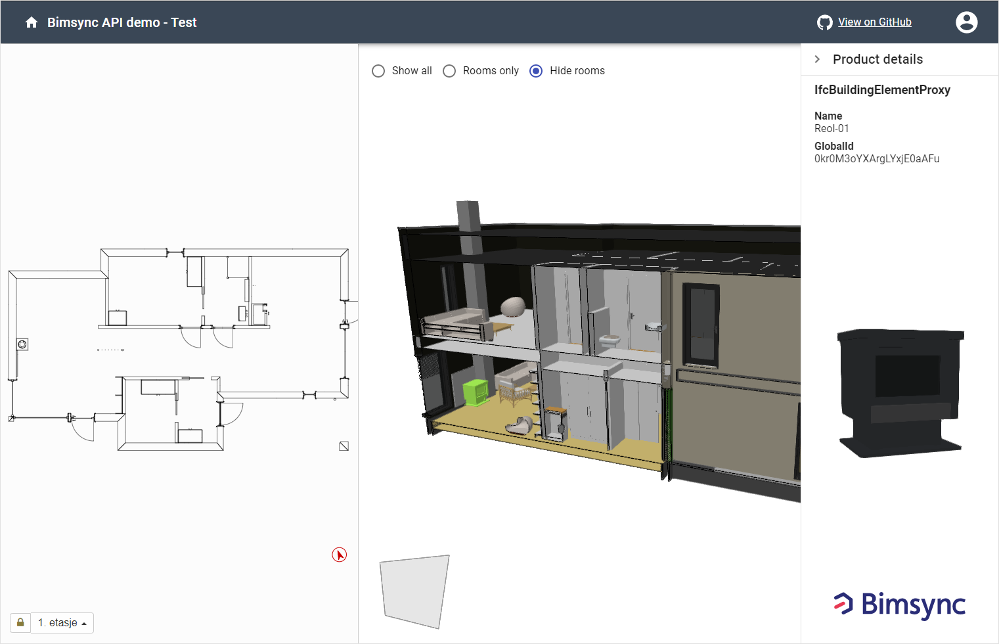

# Bimsync API demo

A simple demo application using [Bimsync APIs](https://catenda.no/products/api).



API documentation:

- [Bimsync Rest API v2](https://bimsync.com/developers/reference/api/v2)
- [Bimsync Viewer 3D API](https://bimsync.com/developers/reference/viewer-3d/1.0)
- [Bimsync Viewer 2D API](https://bimsync.com/developers/reference/viewer-2d/beta)
- [Bimsync Viewer widget API](https://bimsync.com/developers/reference/viewer-widget/1.0)

## Introduction

This is a small demo app intended to show an example of how you can get started with the Bimsync APIs.

The scripts needed for the Bimsync viewer APIs are added in [public/index.html](public/index.html)

This project uses a [Node.js](https://nodejs.org/en/) `server` with [Express](https://expressjs.com/) for its backend.

The frontend uses [React](https://reactjs.org/) and [Material-UI](https://material-ui.com/).

Network requests are done using [axios](https://github.com/axios/axios). Both from the `client` to the `server`, and from the `server` to the `Bimsync API servers`.

The application is configured with [Airbnb's ESLint rules](https://github.com/airbnb/javascript).

_Boiler plate forked from: https://github.com/crsandeep/simple-react-full-stack ._

## Quick Start

### Create an app in Bimsync

To get started you first need to create an App in Bimsync. In order to create a new application you will need to contact [Bimsync support](mailto:support@bimsync.com). _If you plan to put your app into production, you should ask for two apps, one for development and one for production (and one for staging if you need that). And you should also make sure the users' sessions/tokens are stored properly whether you use this example app or your own implementation_.

When an App has been created you can find the App credentials in your [Bimsync account](https://bimsync.com/account/integrations).
To run this demo app in development mode make sure the redirect_uri is set to `http://localhost:9000/auth`.

You should then create a `.env` file at the root of this project and put your development app credentials in there, including `BIMSYNC_REDIRECT_URI=http://localhost:9000/auth`. You can copy the needed variables from the [.env.example](./.env.example) file, and replace the values with your own app credentials.

_If you want to use another port for the development server you must makes sure the `SERVER_PORT` is the same as in the `redirect_uri` and also in [webpack.config.js](./webpack.config.js) `devServer.proxy.target` config._

The `.env` file should never be shared. In production you should set the environment variables in another way to improve the security.

### Build and start the demo app

```bash
# Clone the repository
git clone https://github.com/catenda/bimsync-api-demo.git

# Go inside the directory
cd bimsync-api-demo

# Install dependencies
yarn (or npm install)

# Start development server
yarn dev (or npm run dev)

# Build for production
yarn build (or npm run build)

# Start production server
yarn start (or npm start)
```

### Development mode

In development mode, we will have 2 servers running. The front end code will be served by the [webpack dev server](https://webpack.js.org/configuration/dev-server/) (on `port 3000`) which helps with hot and live reloading. The server side Express code will be served by a node server using [nodemon](https://nodemon.io/) (on `port 9000`) which helps in automatically restarting the server whenever server side code changes.

### Production mode

In production mode, we will have only 1 `server` running. All the `client` side code will be bundled into static files using webpack and it will be served by the Node.js/Express application.

## App logic - authentication flow

In this example app, the `server` will handle all communication with the Bimsync APIs and forward the responses to the `client`. The required access tokens will be stored on the `server` in the users session object.

### Obtaining an access-token

When a user goes to the app url, the app has to be granted access to the users Bimsync account. This is done on the `client` by redirecting the user to a url: `/api/init-auth-flow`. The app `server` will then initiate a request to the Bimsync API requesting a autherization code. Bimsync will then return a redirect response which our `server` will forward to the `client`. The user will then be sent to the sign in screen in Bimsync. After signing in he will be asked to grant access to the app. When the access is granted the authorization code will be sent to the apps `redirect_uri`, which is picked up by the `server`. The `server` then uses the code from the response to requests an `access-token`, the tokens are then stored on the `server` in the users session object. The user is then redirected to the app root url where his/her projects should now appear.

### Refreshing an access-token

The `access-token` will time out after 1 hour and no longer be valid. When doing a request with an invalid token the Bimsync API will return a `401 - Unauthorized` error.

To deal with this we have set up an [axios error interceptor](./src/server/bimsync/axios-interceptors.js) on the `server`. This interceptor will run on all errors and check if the status of the response is 401. If that is the case and we have a `refresh-token` in the users session, we will automatically try to obtain a new `access-token` using the `refresh-token`. If this works we will then re-submit the original request, and return the response to the `client`.

If we do not have a `refresh-token` or the `refresh-token` request fails for some other reason, we will return the original 401 error to the `client`. The `client` is also set up with an [axios interceptor](./src/client/api/app-api.js) that checks for 401 errors. If the `client` receives a 401 error for any of its requests, we will retry the request a few times. We do this because simultaneous requests with an expired token will lead to multiple `refresh-token` requests at the same time. Since any one refresh token only works 1 time, only the first refresh token request will succeed. The other requests will return a 401 error. But when the first request has completed we can retry the other requests which then should also succeed since the `access-token` now is renewed.

If we do not have a valid `refresh-token`, we are not able to obtain a new access token automatically. In this case after retrying a few times, the `client` will initiate the [initial authentication process](#obtaining-an-access-token) again, and the user have to grant access to the app again.

## Using Visual Studio Code

This project includes a .vscode folder with some settings for auto-formating the code and debugging the server. So if you want to use VS Code here is how to set it up and start debugging.

### Installation guide

1.  Install [VSCode](https://code.visualstudio.com/)
2.  Install [ESLint extension](https://marketplace.visualstudio.com/items?itemName=dbaeumer.vscode-eslint)
3.  Install [stylelint extension](https://marketplace.visualstudio.com/items?itemName=stylelint.vscode-stylelint)
4.  Install [Prettier extension](https://marketplace.visualstudio.com/items?itemName=esbenp.prettier-vscode)

When this is set up VSCode should automatically format the code according to linter rules.

### Debugging

To debug the server, first go to VSCode debugger and run the `Server` task:
`Server (bimsync-api-demo)`

Then start the client by running in your terminal:
`yarn client` (or `npm run client`)

## License

The Bimsync API demo app is [ISC licensed](./LICENSE)
